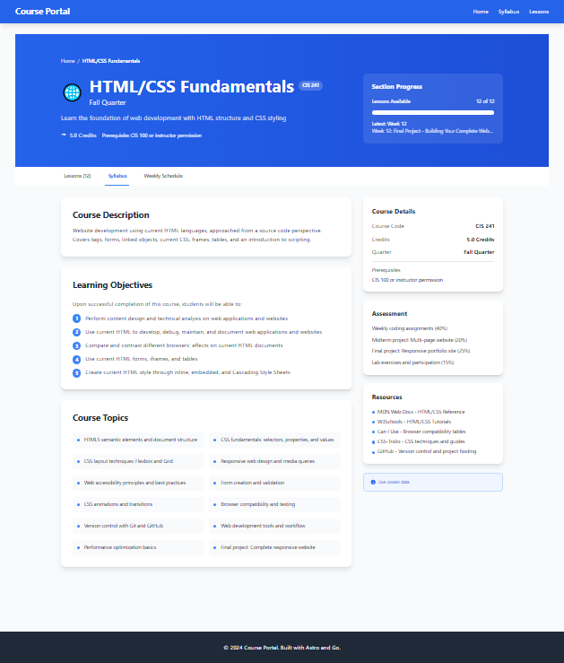
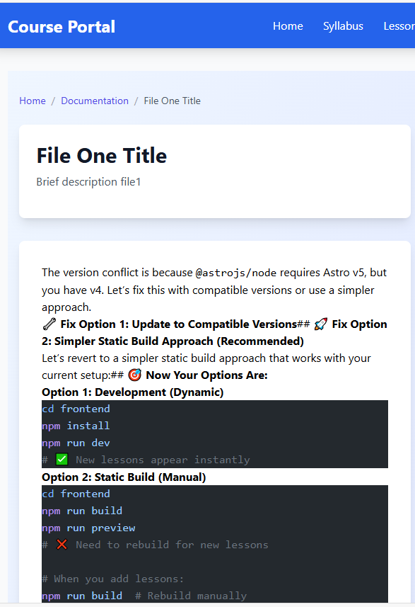

# webdev-class-server-ver2-app

## 9.3.2025

### Why Frontend Updates Require Recompiling
**Go's embed directive works at compile time:**

- Files are read during the go build process
- They become part of the binary's data section
- The embedded filesystem is immutable at runtime

**Technical limitations:**

- embed.FS is read-only
- No way to modify embedded files after compilation
- This is by design for security and performance

#### Alternative Approaches
##### Option 1: Hybrid Architecture (Your Current Setup)

Keep static frontend embedded (fast loading, single binary)
Serve dynamic content via API endpoints
Frontend fetches content from /api/lessons/4 at runtime

##### Option 2: External Static Files

Don't embed frontend files
Serve from filesystem using http.Dir
Can update without recompiling, but requires separate file distribution
```go
go// Instead of embed.FS
http.Handle("/", http.FileServer(http.Dir("./frontend/dist/")))
```

##### Option 3: Template-Based Rendering

Use Go templates instead of static files
Templates can be updated without recompiling
More complex to implement

##### Option 4: Hot Reload Development Server

Separate development server for frontend
Production uses embedded files
Development allows live updates

#### Recommendation
Your current approach is actually optimal for production:

- Fast startup (embedded assets)
- Single executable deployment
- Dynamic content via API
- Clear separation of concerns

The requirement to recompile for frontend changes is a reasonable trade-off for the benefits you get. Most web applications work this way - frontend builds are typically deployed as new versions rather than hot-swapped.

1. 
1. 
1. 
1. 
