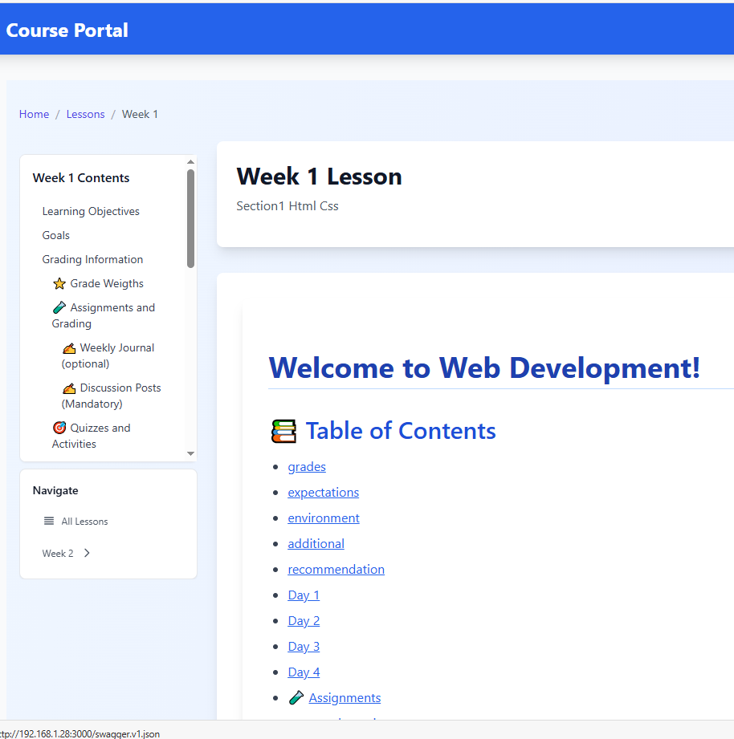
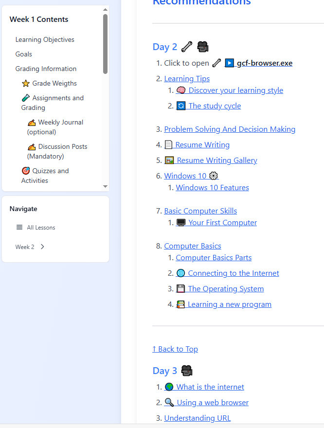
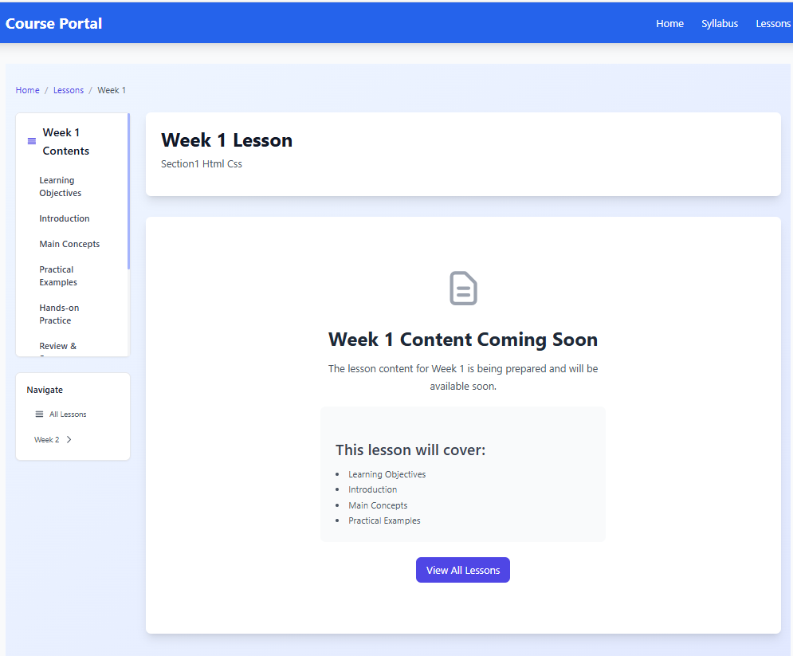
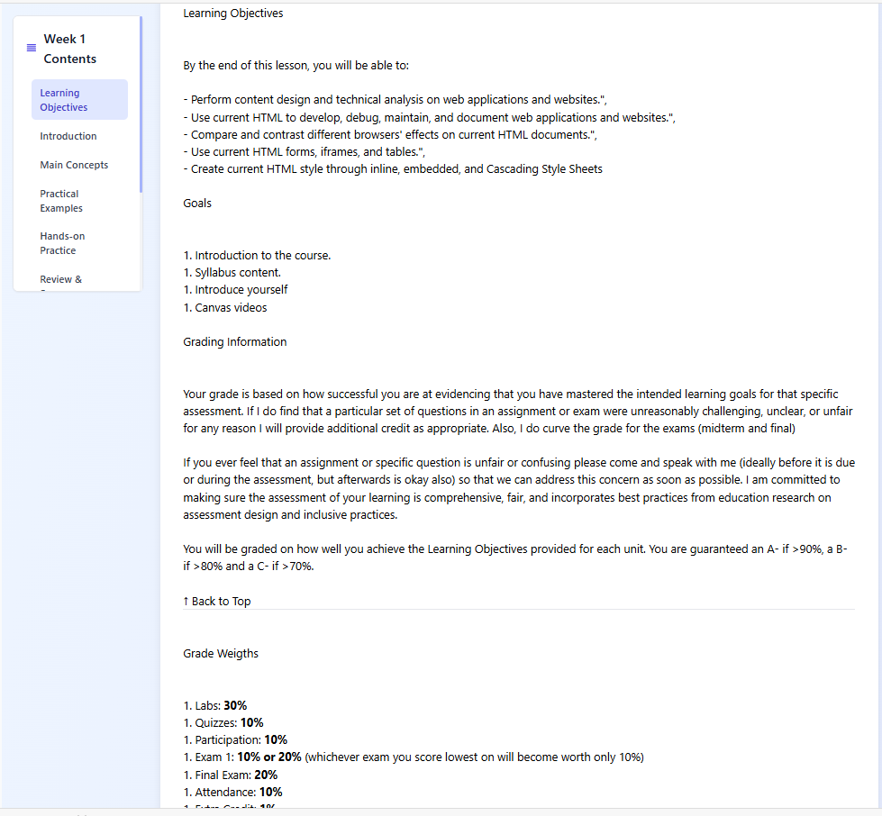
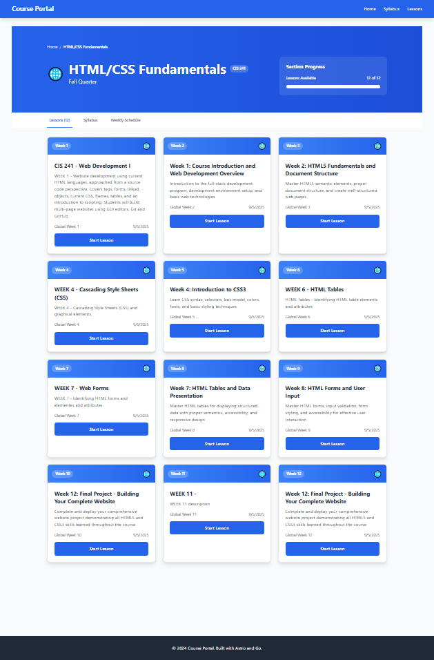
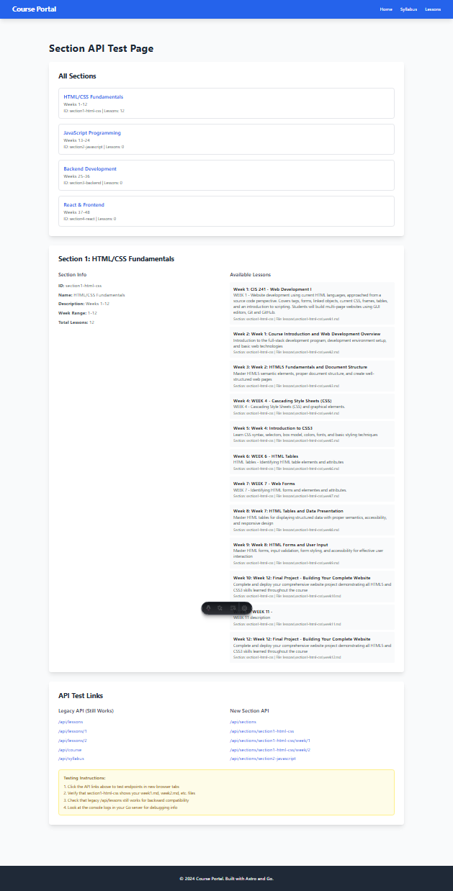
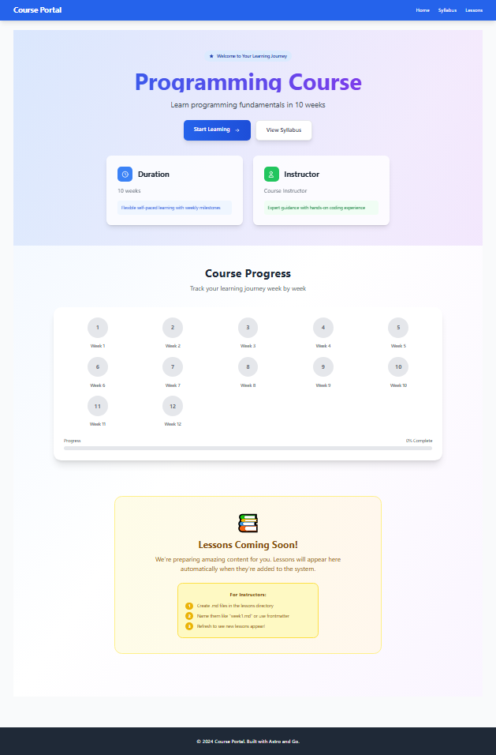

# webdev-class-server-ver2-app


## 9.15.2025

1. 
1. 

## 9.14.2025
1. 
1. 
## 9.12.2025

### TOC internal links issue
1. Tried manual html tag additions: hr, then h1,h2
1. Tried without astro and it worked the original solution by reading /api/sections/section1/week/1/toc and content but stopped working when using astro rendering
1. Tried  Intersection Observer in DynamicTableOfContent
1. Added a script to [week].astro as well javascript to react
1. Finally it was a combination of code that worked
    1. This solution:
    1.Waits for content to load before setting up scroll tracking
    1.Ensures all headings have IDs programmatically
    1.Uses throttled scroll events for better performance
    1.Shows debug info so you can see what's happening
    1.Handles smooth scrolling and URL updates

### Problem with fronend building using API call when go server is down or nonresponsive
1. Resolved the situation adding a conditional that test if the go server is available or not
1. All lessons created an index file and a TOC default or based on the lesson conten

### Testing images and side navigation bar generation

1. Added screenshots from various exe files to week38
1. astro build, go build to v6.2.6.exe
1. Images not rendered
1. added img tags
1. Still images not rendered even with img tags
1.
1. 
1. v2.6.21.exe not crashing, not styled, partially working side navbar "Learning Objectives" and "Assignments" links. "Back to top" internal link working.
1. Images not rendered.


## 9.11.2025
1. created branch weeknavigation to test side navbar. 
1. In Astro development it worked, but it did not build
1. The layout was correct but with hardcoded links
1. Tried to extract the TOC, claude gave three options: static, through API or dinamically using react
1. I started with static using astro dev. It worked but at some point it stopped building so I could not compile go server anymore
1. I created seconddev branch to test TOC extraction in separate files but it did not build or compile
1. Back to development branch and start from fresh.

## 9.10.2025
1. https://edu.gcfglobal.org/en/download/all/

## 9.5.2025
1. Issues with my path /api/sections/section1-html-css/1
1. it was wrong: it should be /api/sections/section1-html-css/week/1
1. Claude suggested a path where /week/1 and /1 would render same but it was not the case: /week/1 rendered the root html not the json response
1. Finally the URL
```
http://localhost:8080/sections-test
```
1. worked perfectly
1. Enhancing the app => /src/pages/sections/[section].astro: ternary operators with JSX prevented the app from building. Tried three iterations but none worked.
1. Refactored with minimal content and if/else statements
1. it built
1. 

## 9.4.2025

### refactoring to include four sections

1. 
1. End points /api/sections /api/sections/section1-2-3-4
1. 
1. tree from sourceforge binary tree.exe to ~/bin folder
1. run tree -I "node_modules|.git|dist|from_claude|course-server|lessons-from-claude"
1. 

## 9.3.2025

### Why Frontend Updates Require Recompiling
**Go's embed directive works at compile time:**

- Files are read during the go build process
- They become part of the binary's data section
- The embedded filesystem is immutable at runtime

**Technical limitations:**

- embed.FS is read-only
- No way to modify embedded files after compilation
- This is by design for security and performance

#### Alternative Approaches
##### Option 1: Hybrid Architecture (Your Current Setup)

Keep static frontend embedded (fast loading, single binary)
Serve dynamic content via API endpoints
Frontend fetches content from /api/lessons/4 at runtime

##### Option 2: External Static Files

Don't embed frontend files
Serve from filesystem using http.Dir
Can update without recompiling, but requires separate file distribution
```go
go// Instead of embed.FS
http.Handle("/", http.FileServer(http.Dir("./frontend/dist/")))
```

##### Option 3: Template-Based Rendering

Use Go templates instead of static files
Templates can be updated without recompiling
More complex to implement

##### Option 4: Hot Reload Development Server

Separate development server for frontend
Production uses embedded files
Development allows live updates

#### Recommendation
Your current approach is actually optimal for production:

- Fast startup (embedded assets)
- Single executable deployment
- Dynamic content via API
- Clear separation of concerns

The requirement to recompile for frontend changes is a reasonable trade-off for the benefits you get. Most web applications work this way - frontend builds are typically deployed as new versions rather than hot-swapped.

1. 
1. 
1. 
1. 
1. 
1. 
1. 
