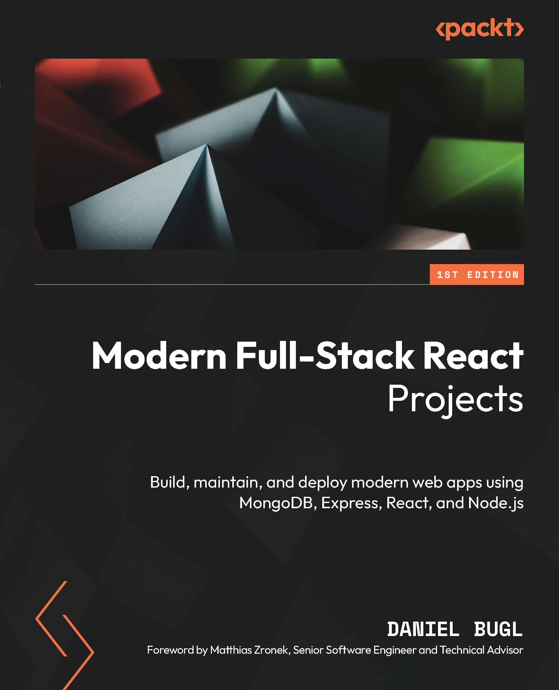

Key benefits
Understand how the different aspects of a MERN application come together through a series of practical projects
Set up frontend and backend projects that can be integrated and maintained together
Enhance your proficiency in building scalable and sustainable React projects
Purchase of the print or Kindle book includes a free PDF eBook
Description
Understanding full-stack development is vital as companies aim to bridge the gap between frontend and backend development. Recent trends show deeper integration between the two, opening numerous possibilities for building real-world web applications, through server-side technologies like Node.js, Express, and MongoDB. Written by the author of Learning Redux and Learn React Hooks, and CEO of TouchLay, Modern Full-Stack React Projects will guide you through the entire process of advancing from a frontend developer to a full-stack developer. Starting with how to set up robust projects that can be maintained for a long time, you’ll then progress toward developing a backend system and integrating it with the frontend. Throughout the book, you’ll learn how to build, test, and deploy a blog application and a chat application. You’ll also explore MongoDB, Express, React, Node.js (MERN) stack, best practices for frontend and backend development, different full-stack architectures, unit and end-to-end testing, and deployment of full-stack web applications. Once you get to grips with the essential concepts, you’ll progress to learn how to use Next.js, an enterprise-grade full-stack web framework for React. By the end, you’ll be well-versed in the MERN stack and all set to create performant and scalable full-stack web applications.
Who is this book for?
This book is for frontend developers, JavaScript engineers, and React developers who possess a solid understanding of JavaScript and React concepts. Specifically designed for those with limited experience in the development, creation, integration, and deployment of backend and full-stack systems, this book will equip you with the necessary skills to create high-quality web applications.
What you will learn
Implement a backend using Express and MongoDB, and unit-test it with Jest
Deploy full-stack web apps using Docker, set up CI/CD and end-to-end tests using Playwright
Add authentication using JSON Web Tokens (JWT)
Create a GraphQL backend and integrate it with a frontend using Apollo Client
Build a chat app based on event-driven architecture using Socket.IO
Facilitate Search Engine Optimization (SEO) and implement server-side rendering
Use Next.js, an enterprise-ready full-stack framework, with React Server Components and Server Actions

## from amazon
Modern Full-Stack React Projects: Build, maintain, and deploy modern web apps using MongoDB, Express, React, and Node.js
by Daniel Bugl (Author), Matthias Zronek (Foreword)
4.6 4.6 out of 5 stars    22 ratings
See all formats and editions
Polish your web development skills by working on real-world projects for different use-cases of full-stack web development

Key Features
Understand how the different aspects of a MERN application come together through a series of practical projects
Set up frontend and backend projects that can be integrated and maintained together
Enhance your proficiency in building scalable and sustainable React projects
Purchase of the print or Kindle book includes a free PDF eBook
Book Description
Understanding full-stack development is vital as companies aim to bridge the gap between frontend and backend development. Recent trends show deeper integration between the two, opening numerous possibilities for building real-world web applications, through server-side technologies like Node.js, Express, and MongoDB.

Written by the author of Learning Redux and Learn React Hooks, and CEO of TouchLay, Modern Full-Stack React Projects will guide you through the entire process of advancing from a frontend developer to a full-stack developer. Starting with how to set up robust projects that can be maintained for a long time, you’ll then progress toward developing a backend system and integrating it with the frontend. Throughout the book, you’ll learn how to build, test, and deploy a blog application and a chat application. You’ll also explore MongoDB, Express, React, Node.js (MERN) stack, best practices for frontend and backend development, different full-stack architectures, unit and end-to-end testing, and deployment of full-stack web applications. Once you get to grips with the essential concepts, you’ll progress to learn how to use Next.js, an enterprise-grade full-stack web framework for React.

By the end, you’ll be well-versed in the MERN stack and all set to create performant and scalable full-stack web applications.

What you will learn
Implement a backend using Express and MongoDB, and unit-test it with Jest
Deploy full-stack web apps using Docker, set up CI/CD and end-to-end tests using Playwright
Add authentication using JSON Web Tokens (JWT)
Create a GraphQL backend and integrate it with a frontend using Apollo Client
Build a chat app based on event-driven architecture using Socket.IO
Facilitate Search Engine Optimization (SEO) and implement server-side rendering
Use Next.js, an enterprise-ready full-stack framework, with React Server Components and Server Actions
Who this book is for
This book is for frontend developers, JavaScript engineers, and React developers who possess a solid understanding of JavaScript and React concepts. Specifically designed for those with limited experience in the development, creation, integration, and deployment of backend and full-stack systems, this book will equip you with the necessary skills to create high-quality web applications.

Table of Contents
Preparing For Full-Stack Development
Getting to Know Node.js, NPM, and MongoDB
Implementing a Backend Service Using Express, Mongoose ODM, and Jest
Integrating Frontend with the Backend Using React and TanStack Query
Deploying the Application with Docker and CI/CD
Adding Authentication and Roles with JSON Web Tokens
Improving the Load Time Using Server-Side Rendering
Making Sure Customers Find You with Search Engine Optimization
Implementing End-to-End Tests Using Playwright
Aggregating and Visualizing Statistics Using MongoDB and Victory
Building a Backend with a GraphQL API
Interfacing with GraphQL on the Frontend Using Apollo Client
(N.B. Please use the Read Sample option to see further chapters)