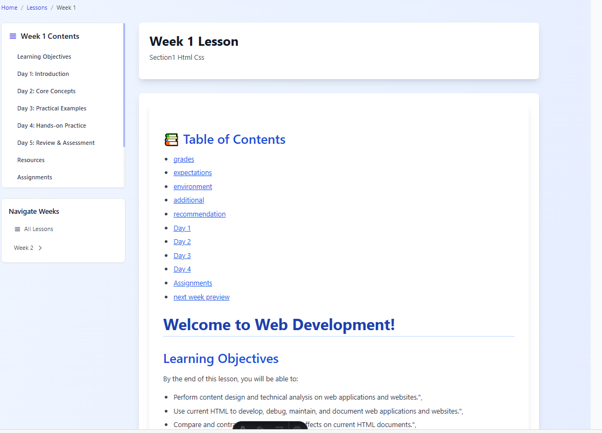

# Lesson  50 Content Here

# Week 13: JavaScript Fundamentals

<!-- Solution 4: Use explicit HTML anchors (most reliable) -->
## 📚 Table of Contents
- [Variables and Data Types](#variables-and-data-types)
- [Functions](#functions)
- [Control Structures](#control-structures)
- [Arrays and Objects](#arrays-and-objects)
- [DOM Manipulation](#dom-manipulation)
- [Practice Exercises](#practice-exercises)


<!-- Use HTML anchors with proper IDs -->
<h2 id="variables-and-data-types">Variables and Data Types</h2>

In JavaScript, you can declare variables using `let`, `const`, or `var`...

```javascript
let name = "John";
const age = 25;
var city = "Seattle";
```

<h2 id="functions">Functions</h2>

Functions are reusable blocks of code...

```javascript
function greet(name) {
    return `Hello, ${name}!`;
}
```

<h2 id="control-structures">Control Structures</h2>

Control structures help you make decisions in your code...

```javascript
if (age >= 18) {
    console.log("You are an adult");
}
```

<h2 id="arrays-and-objects">Arrays and Objects</h2>

Arrays and objects are fundamental data structures...

```javascript
const fruits = ["apple", "banana", "orange"];
const person = { name: "John", age: 25 };
```

<h2 id="dom-manipulation">DOM Manipulation</h2>

The Document Object Model allows you to interact with web pages...

```javascript
document.getElementById("myButton").addEventListener("click", function() {
    alert("Button clicked!");
});
```

<h2 id="practice-exercises">Practice Exercises</h2>

Now let's put what you've learned into practice...

### Exercise 1: Variable Practice
Create variables for different data types and log them to the console.

### Exercise 2: Function Building
Build a calculator function that can add, subtract, multiply, and divide.


